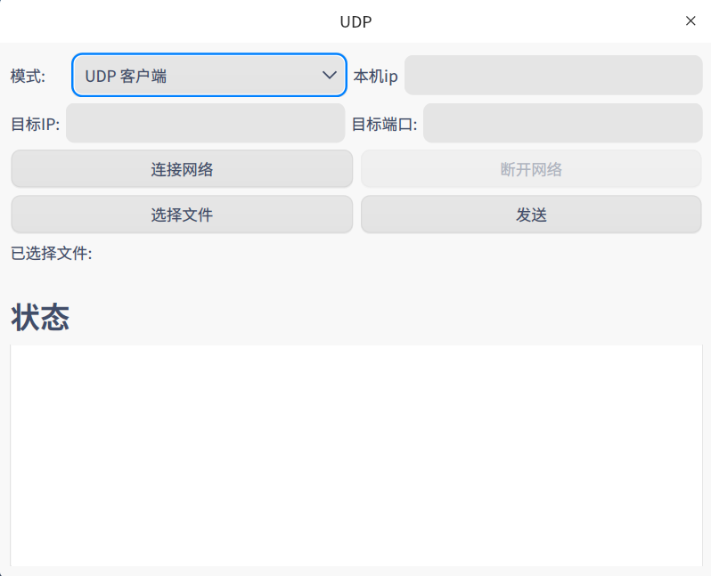
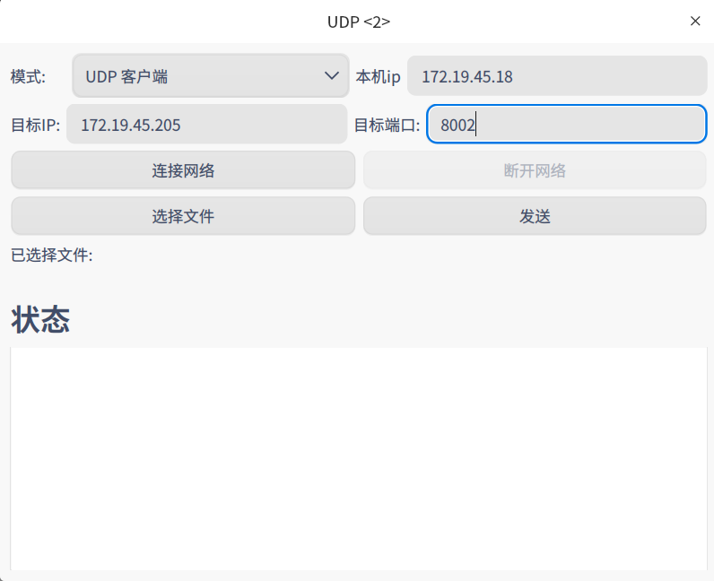
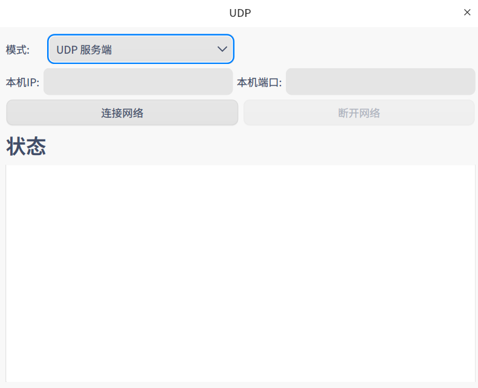
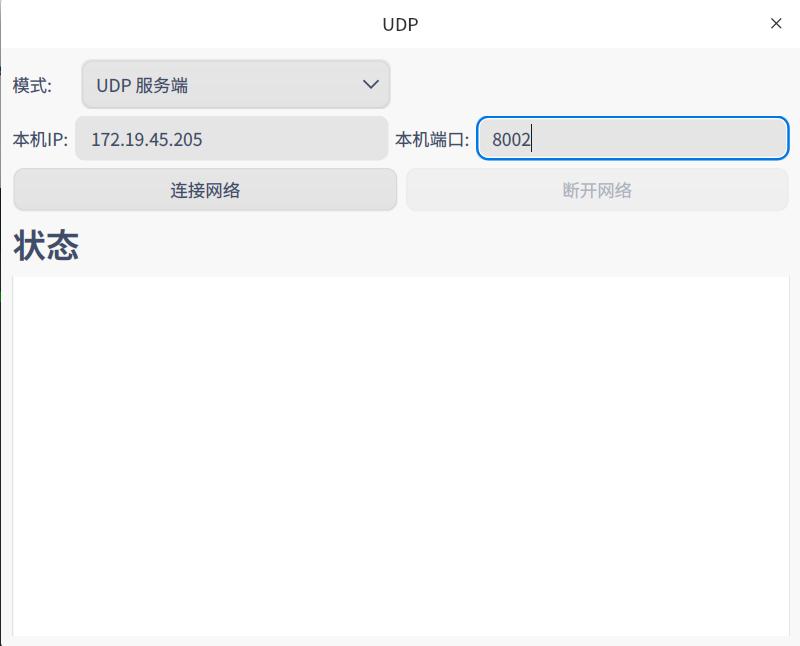
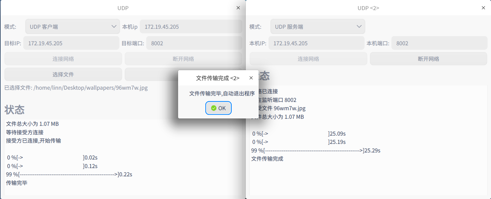
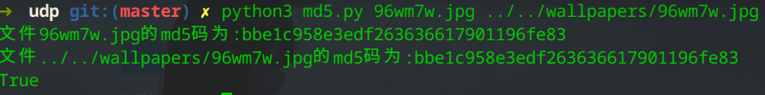

# udp
udp实现可靠传输


可以直接通过运行 pyinstaller 打包好的文件运行程序, 具体命令为

```bash
./dist/main
```

如果不能运行, 尝试使用下列运行源文件方式.


实验运行环境

`python 3.8.0`

`pyqt5>=5.15`


安装依赖命令

```python
pip3 install pyqt5
```


运行程序

```bash
python3 main.py
```


程序使用方法.

客户端界面



客户端使用方法

- 输入本机 ip
- 输入目标 ip 和端口
- 点击连接网络
- 点击选择文件进行文件选择
- 点击发送




服务端界面:




服务端使用方法:

- 输入本机ip和监听端口
- 点击连接网络
- 等待客户端传输文件




传输成功截图:




md5码检验方法:

运行下列命令

```
python3 md5.py 文件1路径 文件2路径
```

示例:



运行注意事项

- 传输文件名称不要包含中文
- 本项目只实现了单次文件传输, 传输结束会自动关闭程序
- 传输得到的文件放在当前文件夹中
